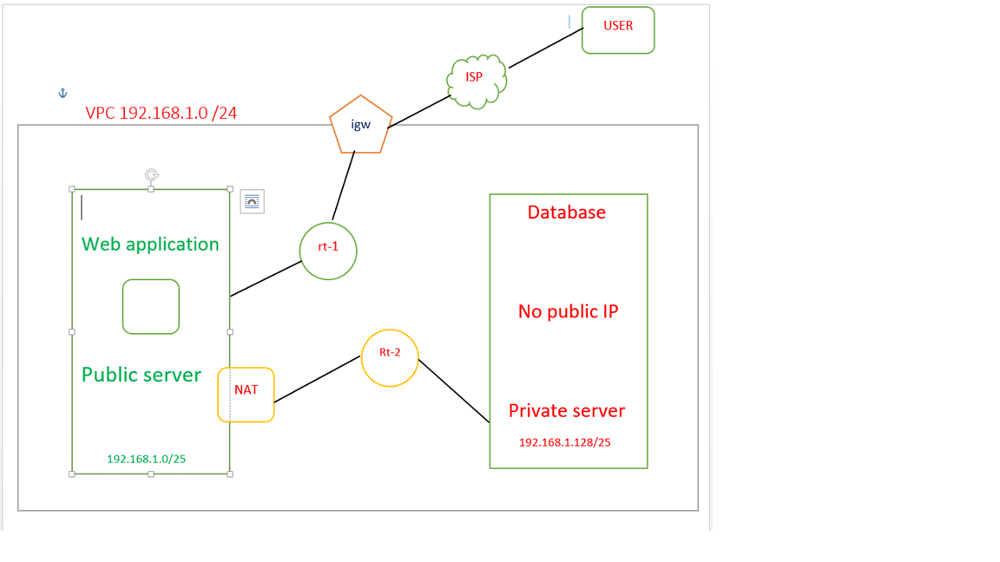

#### \# AWS Bastion Host Architecture

#### 

#### \## 📌 Project Overview

#### 

#### This project demonstrates how to securely access a private Amazon EC2 instance using a Bastion Host within a custom AWS Virtual Private Cloud (VPC). The architecture follows AWS networking and security best practices by placing the Bastion Host in a public subnet while keeping the application server isolated in a private subnet.

#### 

#### To enable secure outbound internet access for the private EC2 instance, a NAT Gateway was configured. This setup ensures that the private instance remains inaccessible from the public internet while still being able to install software updates and required packages.

#### 

#### \---

#### 

#### \## 🎯 Project Objective

#### 

#### The main objectives of this project are:

#### 

#### \- Design a secure AWS network architecture.

#### \- Understand VPC networking concepts.

#### \- Implement Public and Private Subnets.

#### \- Configure Internet Gateway and NAT Gateway.

#### \- Secure EC2 instances using Security Groups.

#### \- Access a private EC2 instance securely through a Bastion Host using SSH.

#### 

#### \---

#### 

#### \# 🏗️ Architecture

#### 

#### > Architecture diagram



#### 

#### \# ☁️ AWS Services Used

#### 

#### | AWS Service            | Purpose                                                           

#### |------------------------|------------------------------------------------------------------

#### |   Amazon VPC           | Created an isolated virtual network for the project.              

#### |   Public Subnet        | Hosted the Bastion Host and NAT Gateway.                          

#### |   Private Subnet       | Hosted the private EC2 instance.                                  

#### |   Internet Gateway     | Allowed internet connectivity for resources in the public subnet. 

#### |   NAT Gateway          | Allowed outbound internet access for the private subnet.          

#### |   Route Tables         | Controlled traffic between subnets and gateways.                  

#### |   Amazon EC2           | Used for the Bastion Host and Private EC2 instances.              

#### |   Security Groups      | Acted as virtual firewalls to control traffic.                    

#### |   SSH                  | Used for secure remote access to Linux servers.                   

#### 

#### \---

#### 

#### &#x20;🚀 Project Implementation

#### 

#### Step 1 – Create a Custom VPC

#### 

#### A custom VPC was created to provide an isolated networking environment and full control over IP addressing, routing, and security.

#### 

#### Step 2 – Create Public and Private Subnets

#### 

#### Two subnets were created inside the VPC:

#### 

#### \- Public Subnet

#### \- Private Subnet

#### 

#### The Bastion Host and NAT Gateway were deployed in the Public Subnet, while the application server was deployed in the Private Subnet.

#### 

#### Step 3 – Configure Internet Gateway

#### 

#### An Internet Gateway was attached to the VPC and associated with the Public Route Table to provide internet access for the Bastion Host.

#### 

#### Step 4 – Configure NAT Gateway

#### 

#### A NAT Gateway was deployed in the Public Subnet to provide outbound internet access to the private EC2 instance without exposing it to inbound internet traffic.

#### 

#### Step 5 – Configure Route Tables

#### 

#### Two Route Tables were configured:

#### 

#### &#x20;Public Route Table

#### 

#### \- Route to Internet Gateway

#### 

#### &#x20;Private Route Table

#### 

#### \- Route to NAT Gateway

#### 

#### This configuration ensures that only the Public Subnet has direct internet access.

#### 

#### Step 6 – Launch EC2 Instances

#### 

#### Two EC2 instances were launched:

#### 

#### &#x20;Bastion Host

#### 

#### \- Deployed in the Public Subnet

#### \- Assigned a Public IP Address

#### 

#### &#x20;Private EC2

#### 

#### \- Deployed in the Private Subnet

#### \- No Public IP Address

#### 

#### \---

#### 

#### &#x20;Step 7 – Configure Security Groups

#### 

#### &#x20;Bastion Host Security Group

#### 

#### Inbound Rule

#### 

#### \- SSH (Port 22) → anywhere 

#### 

#### Outbound Rule

#### 

#### \- Allow All Traffic

#### 

#### \---

#### 

#### &#x20;Private EC2 Security Group

#### 

#### Inbound Rule

#### 

#### \- SSH (Port 22) → Bastion Host Security Group

#### 

#### Outbound Rule

#### 

#### \- Allow All Traffic

#### 

#### This ensures that the private EC2 instance can only be accessed through the Bastion Host.

#### 

#### \---

#### 

#### Step 8 – SSH Connectivity

#### 

#### Connected to the Bastion Host using SSH:

#### 

#### ```bash

#### ssh -i key.pem ec2-user@<Bastion-Public-IP>

#### ```

#### 

#### After logging into the Bastion Host, connected to the Private EC2 instance:

#### 

#### ```bash

#### ssh -i key.pem ec2-user@<Private-EC2-Private-IP>

#### ```

#### 

#### This demonstrates secure administrative access to a private server without exposing it to the internet.

#### 

#### \---

#### 

#### \# 🔐 Security Implementation

#### 

#### \- Private EC2 has no Public IP.

#### \- Bastion Host acts as the only entry point.

#### \- Security Groups restrict SSH access.

#### \- NAT Gateway provides outbound internet access only.

#### \- Private resources remain isolated from direct internet access.

#### 

#### \---

#### 

#### \# 📸 Project Screenshots

#### 

#### \- VPC Overview

#### \- Public \& Private Subnets

#### \- Route Tables

#### \- Internet Gateway

#### \- NAT Gateway

#### \- Bastion Host ec2 instance

#### \- Private EC2 instance

#### \- SSH Login to Bastion Host

#### \- SSH Login to Private EC2

#### 

#### \---

#### 

#### \# 📚 Key Learnings

#### 

#### Through this project, I gained hands-on experience with:

#### 

#### \- Amazon VPC

#### \- Public \& Private Subnets

#### \- Internet Gateway

#### \- NAT Gateway

#### \- Route Tables

#### \- Security Groups

#### \- Amazon EC2

#### \- SSH Connectivity

#### \- Bastion Host Architecture

#### \- Secure AWS Networking

#### 

#### \---

#### 

#### \# 🚀 Future Improvements

#### 

#### \- Provision infrastructure using Terraform.

#### \- Replace Bastion Host with AWS Systems Manager Session Manager.

#### \- Automate deployment using Infrastructure as Code (IaC).

#### \- Add CloudWatch monitoring and logging.

#### 

#### \---

#### 

#### \# 👩‍💻 Author

#### 

#### Vaishali Sharma

#### 

#### Aspiring Cloud \& DevOps Engineer

#### 

#### GitHub: https://github.com/Sharmavaishali44

#### 

#### LinkedIn: www.linkedin.com/in/vaishali-sharma-3ab548327


